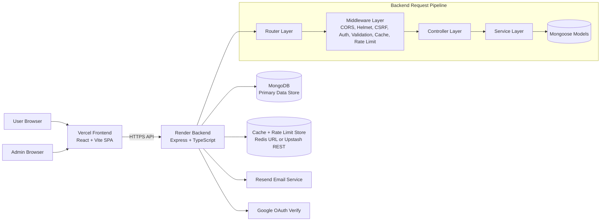

# Resume Builder SaaS

A full-stack resume builder platform with authentication, resume editing, template browsing, and admin tools.

## Whole Project Overview

Resume Builder SaaS is a two-application system:

1. A frontend SPA (React + Vite) deployed on Vercel for user and admin interfaces.
2. A backend API (Express + TypeScript) deployed on Render for business logic, auth, and data APIs.

Core platform responsibilities:

1. User identity and session lifecycle (signup, login, logout, reset, refresh).
2. Resume data management with secure user scoping.
3. Template discovery and admin template operations.
4. ATS analysis and suggestion-apply flows.
5. Distributed caching and rate limiting for performance and abuse control.
6. Observability (logs, metrics, tracing) and security middleware.

## Architecture Diagram



## Feature Explainer

### 1. Authentication and Session

1. Email/password signup and login.
2. Google login integration.
3. Access and refresh token cookie flow.
4. Password reset and resend handling.
5. Current user identity endpoint and logout.

### 2. Resume Management

1. Create, list, update, and delete resumes.
2. Resume detail retrieval by ID with user ownership checks.
3. Export preset endpoint for rendering/export behavior.
4. Versioning support for resume changes.

### 3. ATS Enhancement

1. ATS scoring and keyword analysis.
2. Suggestion generation for bullet and summary improvements.
3. Apply-suggestion flow that updates resume content.
4. Resume version comparison support.

### 4. Template and Admin Operations

1. Public template listing for end users.
2. Admin template CRUD, status updates, premium toggles, and reorder.
3. Usage recording and analytics/dashboard endpoints.

### 5. Performance and Safety

1. Distributed response caching on selected read endpoints.
2. Per-user cache scoping for private resume data.
3. Cache invalidation on write operations.
4. Route-level rate limiting for auth and admin mutations.
5. Fail-open behavior if cache backend is unavailable.

### 6. Security and Observability

1. Helmet and strict CORS origin validation.
2. CSRF protection for state-changing endpoints.
3. Request schema validation via Zod.
4. Structured logging and metrics/tracing hooks.

## End-to-End Flow

1. Frontend sends request to backend API.
2. Backend router matches endpoint.
3. Middleware stack executes:
	 1. security and CORS checks,
	 2. auth/admin checks,
	 3. request validation,
	 4. cache lookup and/or rate-limit checks.
4. Controller executes business logic and data access.
5. Response is cached when eligible.
6. On write endpoints, related cache scopes are invalidated.
7. Response returns with operational headers such as cache and rate-limit metadata.

## Repository Layout

- Backend: Node.js, Express, TypeScript, MongoDB
- frontend: React, TypeScript, Vite, Zustand

## Features

- Email and password signup/login
- Google OAuth login
- JWT access and refresh token flow
- Resume create, edit, list, and delete
- Template browsing and admin template management
- ATS analysis and suggestion apply flow
- CSRF protection, CORS controls, request validation
- Redis and Upstash-backed distributed cache and rate limiting

## Local Run

### Backend

1. Open terminal in Backend.
2. Install dependencies.
3. Configure env vars.
4. Start dev server.

```bash
cd Backend
npm install
npm run dev
```

### Frontend

1. Open terminal in frontend.
2. Install dependencies.
3. Configure frontend env vars.
4. Start Vite dev server.

```bash
cd frontend
npm install
npm run dev
```

## Backend Environment Variables

Core:
- NODE_ENV
- PORT
- MONGO_URI
- FRONTEND_URL
- FRONTEND_URLS
- JWT_ACCESS_SECRET
- JWT_REFRESH_SECRET
- RESEND_API_KEY
- RESEND_FROM or EMAIL_FROM
- GOOGLE_CLIENT_ID

Cache and rate limiting:
- REDIS_URL
- UPSTASH_REDIS_REST_URL
- UPSTASH_REDIS_REST_TOKEN
- REDIS_CACHE_TTL_SECONDS
- REDIS_RATE_LIMIT_WINDOW_MS
- REDIS_RATE_LIMIT_MAX

Provider selection order:
1. REDIS_URL (Redis protocol mode)
2. UPSTASH_REDIS_REST_URL + UPSTASH_REDIS_REST_TOKEN (Upstash REST mode)
3. No provider configured: middleware fails open

## Cache and Rate-Limit Flow

### Cache flow

1. Request hits cache middleware.
2. Middleware resolves cache scope and cache key.
3. If payload exists, returns HIT response immediately.
4. If payload missing, request goes to controller and successful 2xx response is cached.
5. On write operations, affected cache scope is invalidated.

### Rate-limit flow

1. Middleware increments key counter scoped by route and user/ip.
2. Window TTL is applied when counter starts.
3. If count exceeds max, request is blocked with status 429.
4. If cache backend is unavailable, middleware fails open.

## Routes with Cache Applied

- GET /api/templates
- GET /api/admin/analytics/dashboard
- GET /api/admin/analytics/templates
- GET /api/admin/templates
- GET /api/admin/templates/:id
- GET /api/resumes (per-user scoped cache)
- GET /api/resumes/:id (per-user scoped cache)

## Routes with Rate Limiting Applied

- POST /api/auth/signup
- POST /api/auth/login
- POST /api/auth/forgot-password
- POST /api/auth/reset-password
- POST /api/auth/resend
- POST /api/auth/google-login
- POST /api/admin/templates
- PUT /api/admin/templates/reorder
- PUT /api/admin/templates/:id
- PATCH /api/admin/templates/:id/status
- PATCH /api/admin/templates/:id/premium
- DELETE /api/admin/templates/:id
- POST /api/admin/usage

## Invalidation Rules

- Template create/update/delete/reorder/status changes invalidate template cache scopes.
- Resume create/update/delete invalidates current user resume scope.
- ATS suggestion apply invalidates current user resume scope.

## Testing

### Automated Backend Tests

Automated tests are now available for core backend utility and middleware behavior.

Covered by `npm test` in `Backend`:

1. Token hashing utility (`hashToken`) deterministic and format behavior.
2. Cookie parsing utility (`parseCookies`) parsing and decode behavior.
3. JWT generation utilities (`generateAccessToken`, `generateRefreshToken`) signature and payload behavior.
4. Auth cookie helpers (`setAccessTokenCookie`, `setCsrfCookie`, `setAuthCookies`, `clearAuthCookies`) cookie contract behavior.
5. Request validation middleware (`validateRequest`) success and error response behavior.

Run automated tests:

```bash
cd Backend
npm test
```

You can also run:

```bash
cd Backend
npm run test:automated
```

### Manual Testing (Still Required)

The following areas still require manual or integration-level testing because they depend on external services and full request flows:

1. End-to-end auth flows with real cookies across frontend and backend.
2. Redis/Upstash distributed cache hit, miss, and invalidation behavior.
3. Rate-limit enforcement behavior under repeated real requests.
4. Email delivery and reset-link flow.
5. Google login verification flow.

Run existing manual scripts:

```bash
cd Backend
npm run test:rate-limit:login
npm run test:rate-limit:forgot-password
npm run test:cache:templates
```

## Manual Testing Procedure

### 1. Public templates cache

1. Call GET /api/templates.
2. Confirm response header X-Cache is MISS.
3. Call GET /api/templates again.
4. Confirm response header X-Cache is HIT.

### 2. Resume per-user cache isolation

1. Login as user A.
2. Call GET /api/resumes twice and confirm MISS then HIT.
3. Login as user B.
4. Call GET /api/resumes and verify no user A data appears.

### 3. Resume invalidation after writes

1. Call GET /api/resumes until HIT.
2. Create or update resume.
3. Call GET /api/resumes and confirm MISS.
4. Call GET /api/resumes again and confirm HIT.

### 4. Rate-limit behavior

1. Repeatedly call POST /api/auth/login with bad credentials.
2. Confirm status 429 appears after threshold.
3. Confirm X-RateLimit-Limit, X-RateLimit-Remaining, Retry-After headers.

## Screenshot Checklist for README Test Evidence

Add these screenshots:

1. Terminal output for npm run build.
2. First GET /api/templates showing X-Cache MISS.
3. Second GET /api/templates showing X-Cache HIT.
4. User A GET /api/resumes showing cache headers.
5. User B GET /api/resumes showing separate response and cache behavior.
6. Resume write request followed by GET /api/resumes showing invalidation (MISS then HIT).
7. Rate-limit 429 response including retry headers.

## Deployment Notes

- Dockerfiles are available for backend and frontend.
- docker-compose.yml supports local development services.
- render.yaml is used for backend deployment settings.
- vercel.json is used for frontend SPA routing on Vercel.

---

## Previous README (Restored)

# Resume Builder SaaS

A full-stack resume builder platform with authentication, resume editing, template browsing, and an admin dashboard.

This repository is split into:
- `Backend` - Node.js, Express, TypeScript, MongoDB
- `frontend` - React, TypeScript, Vite, Zustand

## What It Does

- Email/password signup and login
- Google OAuth login
- JWT access and refresh token session flow
- Resume create, edit, save, load, and delete
- Style customization for fonts, spacing, colors, and layout
- Section visibility and ordering controls
- Live resume preview and browser-based PDF export
- Public template browsing and template initialization
- Admin analytics and template management
- Security hardening with Helmet, CORS, and CSRF protection
- Request validation, structured logging, and metrics/tracing

## Project Structure

### Backend

- `src/config/` - database and environment setup
- `src/controllers/` - auth, resume, template, and refresh handlers
- `src/middleware/` - auth, CSRF, and validation middleware
- `src/models/` - MongoDB models for users, resumes, templates, reset tokens, usage, and versions
- `src/router/` - route registration by feature area
- `src/services/` - template and resume version helpers
- `src/utils/` - token helpers, email, cookies, logging helpers
- `src/validation/` - Zod schemas for request payloads

### Frontend

- `src/pages/` - route-level pages like home, login, builder, resumes, templates, and admin
- `src/components/` - UI grouped by domain
- `src/store/` - Zustand resume builder state
- `src/services/` - Axios client and session bootstrap
- `src/templates/` - resume rendering engine
- `src/types/` - shared TypeScript contracts

## Running Locally

### Backend

1. Install dependencies in `Backend`.
2. Set environment variables for MongoDB, frontend URL, JWT secrets, email provider, and OAuth.
3. Start the server on the configured port.

### Frontend

1. Install dependencies in `frontend`.
2. Set `VITE_API_BASE_URL` to the backend API URL.
3. Start the Vite dev server.

## Environment Variables

### Backend

- `NODE_ENV`
- `PORT`
- `MONGO_URI`
- `FRONTEND_URL`
- `FRONTEND_URLS`
- `JWT_ACCESS_SECRET`
- `JWT_REFRESH_SECRET`
- `RESEND_API_KEY`
- `RESEND_FROM` or `EMAIL_FROM`
- `GOOGLE_CLIENT_ID`

### Frontend

- `VITE_API_BASE_URL`
- `VITE_GOOGLE_CLIENT_ID`

## Notes

- The builder now focuses on resume creation, editing, preview, and export.
- Public share links and the separate Pro panel have been removed.
- The admin dashboard still provides template and usage insights.

## Deployment

- Dockerfiles are included for both apps.
- `docker-compose.yml` can be used for local development with MongoDB.
- `render.yaml` and `vercel.json` support deployment targets.
