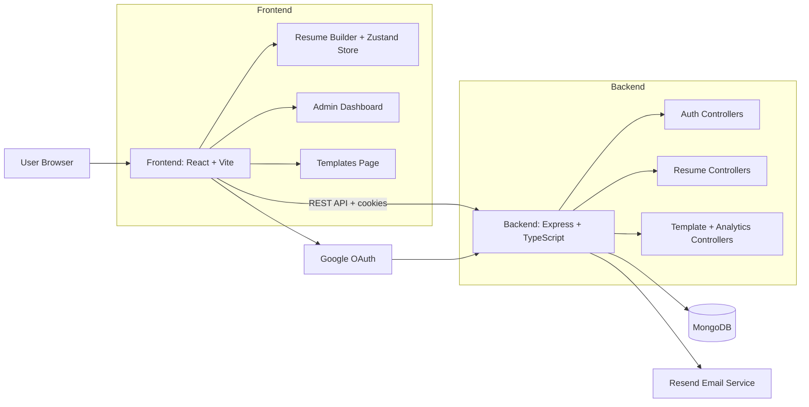
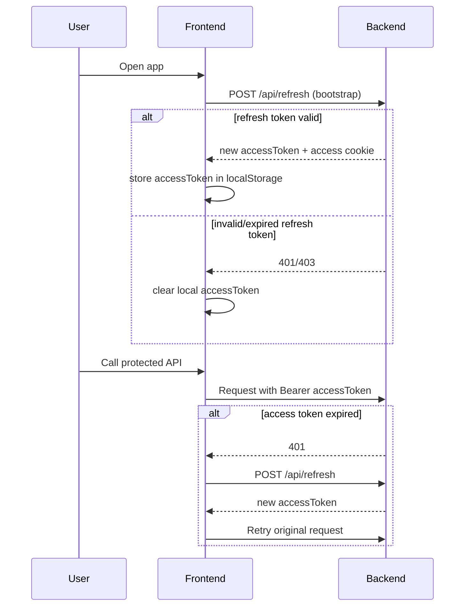
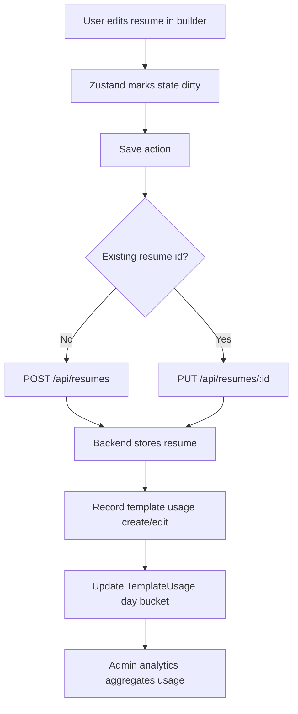

# Resume Builder SaaS

A full-stack resume builder platform with authentication, resume creation/editing, template marketplace, and an admin analytics dashboard.

This repository is split into:
- `Backend` (Node.js + Express + TypeScript + MongoDB)
- `frontend` (React + TypeScript + Vite + Zustand)

---

## What You Have Completed So Far

### 1) Authentication and User Management
- Email/password signup and login
- Google OAuth login
- JWT-based access + refresh token flow
- Refresh endpoint for session continuation after reload
- Secure cookie strategy for access/refresh cookies
- Logout endpoint
- Current-user endpoint (`/auth/me`) with role data
- Forgot password + reset password + resend reset link workflow
- Reset protections: token hashing, token expiry, cooldown, resend limits

### 2) Resume Builder Core
- Resume CRUD APIs with per-user ownership checks
- Rich resume schema (personal info, experience, education, skills, projects, certifications, languages)
- Style customization (fonts, color tokens, spacing, bullets, alignment)
- Section visibility toggles and drag/drop section ordering
- Live preview rendering
- Save and update from the builder page
- Download/print to PDF flow
- Unsaved-change protection before page leave
- Keyboard shortcut support (`Ctrl/Cmd + S`) for saving

### 3) Template System
- Public template listing endpoint (`/api/templates`)
- Template metadata and visual config (`cssVars`, `slots`)
- Builder initialization from template selection
- Fallback behavior when template API is unavailable
- Template usage tracking on resume create/edit

### 4) Admin Panel
- Role-protected admin route in frontend
- Admin dashboard with analytics period switching (7/30 days)
- Template management UI (create, update, publish/draft/archive, toggle premium, delete)
- Template search and filters by status/category
- Template preview modal with sample resume rendering
- Reorder template endpoint
- Aggregated usage analytics and trend calculations

### 5) Deployment and Containerization
- Dockerfiles for backend and frontend
- Docker Compose setup with MongoDB service
- Deployment guide for Render (backend) and Vercel (frontend)
- Environment-variable based configuration for local and production

---

## Architecture Overview



---

## Auth and Session Flow



---

## Resume Save and Template Usage Flow



---

## Folder-Level Explanation

### Backend (`Backend/src`)
- `config/`: DB connection setup
- `controllers/`: business logic for auth, refresh, resumes, templates
- `middleware/`: JWT auth and admin authorization guards
- `models/`: Mongoose schemas for users, resumes, templates, reset tokens, usage stats
- `router/`: Express route registration by domain
- `services/`: template service layer (CRUD + analytics calculations)
- `utils/`: token generation, email sender, cookie parsing, Google token verify helpers

### Frontend (`frontend/src`)
- `pages/`: route-level pages (home, login, templates, builder, resumes, admin)
- `components/`: UI components grouped by domain (auth/admin/builder/templates/myResumes)
- `store/`: Zustand state for the resume builder
- `hooks/`: API-facing hooks for admin templates, analytics, and resumes
- `services/`: Axios instance, interceptors, bootstrap refresh logic
- `templates/`: resume rendering engine
- `types/`: shared TypeScript contracts

---

## API Surface Implemented

### Auth
- `POST /api/auth/signup`
- `POST /api/auth/login`
- `POST /api/auth/google-login`
- `POST /api/auth/logout`
- `GET /api/auth/me`
- `POST /api/auth/forgot-password`
- `POST /api/auth/reset-password`
- `POST /api/auth/resend`
- `POST /api/refresh`

### Resume
- `GET /api/resumes`
- `GET /api/resumes/:id`
- `POST /api/resumes`
- `PUT /api/resumes/:id`
- `DELETE /api/resumes/:id`

### Templates and Admin
- `GET /api/templates` (public)
- `GET /api/admin/analytics/dashboard`
- `GET /api/admin/analytics/templates?days=7|30`
- `GET /api/admin/templates`
- `GET /api/admin/templates/:id`
- `POST /api/admin/templates`
- `PUT /api/admin/templates/reorder`
- `PUT /api/admin/templates/:id`
- `PATCH /api/admin/templates/:id/status`
- `PATCH /api/admin/templates/:id/premium`
- `DELETE /api/admin/templates/:id`
- `POST /api/admin/usage` (authenticated usage logging)

---

## Tech Stack

### Frontend
- React 19 + TypeScript
- Vite
- Zustand
- Axios
- React Router
- Framer Motion / custom UI components

### Backend
- Node.js + Express 5 + TypeScript
- MongoDB + Mongoose
- JWT auth
- bcrypt password hashing
- Resend transactional email
- Google token verification (`google-auth-library`)

### DevOps
- Docker + Docker Compose
- Render deployment (backend)
- Vercel deployment (frontend)

---

## Local Development

## 1. Clone and install

```bash
# backend
cd Backend
npm install

# frontend
cd ../frontend
npm install
```

## 2. Backend environment (`Backend/.env`)

```env
PORT=5000
MONGO_URI=your_mongodb_connection_string
FRONTEND_URL=http://localhost:5173
JWT_ACCESS_SECRET=your_access_secret
JWT_REFRESH_SECRET=your_refresh_secret
RESEND_API_KEY=your_resend_api_key
RESEND_FROM=Your App <onboarding@resend.dev>
GOOGLE_CLIENT_ID=your_google_client_id
NODE_ENV=development
```

## 3. Frontend environment (`frontend/.env`)

```env
VITE_API_BASE_URL=http://localhost:5000/api
VITE_GOOGLE_CLIENT_ID=your_google_client_id
```

## 4. Run locally

```bash
# terminal 1
cd Backend
npm run dev

# terminal 2
cd frontend
npm run dev
```

Frontend: `http://localhost:5173`
Backend: `http://localhost:5000`

---

## Docker Run (Optional)

```bash
docker compose up --build
```

---

## Deployment

- Backend deployment target: Render
- Frontend deployment target: Vercel
- Detailed guide available in `DEPLOYMENT_GUIDE.md`

---

## Project Review Snapshot

What is strong right now:
- Good separation of concerns (routes/controllers/services/models)
- Security-focused auth flow with refresh token recovery and guarded admin routes
- Thoughtful resume domain model and editing UX
- Clear admin analytics and template management features
- Production-conscious deployment docs and container setup

Potential next improvements:
- Add automated tests (unit + API integration + frontend component tests)
- Add API docs (OpenAPI/Swagger)
- Add request validation layer (e.g., Zod/Joi) before controllers
- Add centralized error handling middleware and structured logging
- Add `.env.example` files for backend/frontend

---

## Status

This project is beyond MVP and already includes:
- user auth + session handling
- resume builder + persistent storage
- template marketplace + admin controls
- template analytics
- deployment path to production

You now have a solid foundation to move into hardening (tests, observability, validation) and product iteration.
