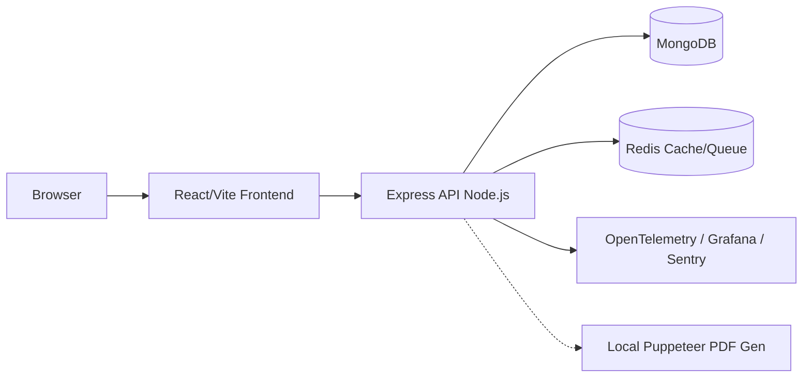

# Resume Builder Platform

[](https://github.com/Rahul-Karki/Resume-Builder-Project/actions)
[](https://opensource.org/licenses/MIT)
[](https://github.com/Rahul-Karki/Resume-Builder-Project)
[](https://github.com/Rahul-Karki/Resume-Builder-Project)

A production-ready, full-stack resume builder application featuring authenticated resume management, dynamic template rendering, AI-assisted content improvements, ATS (Applicant Tracking System) analysis, and asynchronous PDF generation.

---

## 📑 Table of Contents

- [Features](#features)
- [Architecture](#architecture)
- [Installation & Setup](#installation--setup)
- [Configuration](#configuration)
- [Usage Examples](#usage-examples)
- [Development Guide](#development-guide)
- [Deployment Instructions](#deployment-instructions)
- [Key Components](#key-components)
- [Contributing](#contributing)
- [License](#license)
- [Contact & Support](#contact--support)

---

## ✨ Features

- **Advanced UI/UX:** Built with React 19, Tailwind CSS 4, Framer Motion, and Shadcn/Radix UI.
- **AI Integration:** Context-aware bullet point enhancement, grammar checking, and ATS analysis powered by OpenAI/Gemini.
- **Robust Backend:** Express 5 (Beta) API with TypeScript, MongoDB, and Redis caching.
- **High Security:** Built-in CSRF protection with automatic token rotation, HTTP-only cookies, JWT auth, rate limiting, and Helmet.
- **Observability Built-in:** OpenTelemetry integration, Sentry error tracking, Pino logging, and Prometheus metrics.
- **High-Fidelity PDF Generation:** Pixel-matched PDF rendering using Puppeteer.
- **Resilient Networking:** Axios interceptors with exponential backoff for transient failures.

---

## 🏗 Architecture

The project is structured into three primary workspaces managed via npm workspaces:

- `frontend`: React, Vite, TypeScript, Zustand, Tailwind, and Playwright E2E tests.
- `Backend`: Express, TypeScript, MongoDB, Redis-backed cache/rate limits, OpenAPI metadata, and OpenTelemetry.
- `shared`: Shared TypeScript contracts, BullMQ types, and AI interfaces used across the stack.



---

## 🚀 Installation & Setup

### Prerequisites

- [Node.js](https://nodejs.org/) (v20 or higher)
- [MongoDB](https://www.mongodb.com/)
- [Redis](https://redis.io/)
- [Docker](https://www.docker.com/) (Optional, for infrastructure)

### 1. Start Infrastructure

If you have Docker installed, you can easily spin up the required databases:

```bash
docker-compose up -d mongo redis
```

### 2. Install Dependencies

Install dependencies for all workspaces:

```bash
npm install # If using a root package.json
# OR manually:
cd Backend && npm install
cd ../frontend && npm install
```

### 3. Environment Configuration

Copy the example environment files and populate them with your secrets.

```bash
cp Backend/.env.example Backend/.env
cp frontend/.env.example frontend/.env
```

**Critical Secrets to Configure:**
- `MONGO_URI`: Your MongoDB connection string.
- `REDIS_URL`: Your Redis connection string.
- `JWT_ACCESS_SECRET` & `JWT_REFRESH_SECRET`: Secure random strings for token generation.
- `OPENAI_API_KEY` / `GEMINI_API_KEY`: API keys for AI functionalities.

---

## ⚙️ Configuration

The application uses **Zod** for strict environment variable validation. If a required variable is missing or malformed, the application will fail to start and log the specific issue.

### Backend (`Backend/.env`)
| Variable | Description | Default |
|----------|-------------|---------|
| `NODE_ENV` | Application environment (`development`, `production`, `test`) | `development` |
| `PORT` | API Port | `5000` |
| `FRONTEND_URL` | Used for CORS and PDF rendering. | - |
| `USE_MEMORY_ONLY_CACHE` | Set to `false` in production to enforce Redis usage. | `true` |
| `AI_PROVIDER` | `openai`, `gemini`, or `auto` | `auto` |
| `ENABLE_METRICS`| Enable Prometheus metrics endpoint | `true` |

### Frontend (`frontend/.env`)
| Variable | Description | Default |
|----------|-------------|---------|
| `VITE_API_BASE_URL` | URL pointing to the Backend API | `http://localhost:5000/api` |

*Refer to the respective `.env.example` files for a complete list of configuration options.*

---

## 💻 Usage Examples

### Running Locally

Start the development servers concurrently:

```bash
# Terminal 1 - Backend
cd Backend
npm run dev

# Terminal 2 - Frontend
cd frontend
npm run dev
```

### API Usage (Authentication)

The backend uses HttpOnly cookies for sessions. To authenticate programmatically:

```bash
# Login
curl -X POST http://localhost:5000/api/auth/login \
  -H "Content-Type: application/json" \
  -d '{"email": "user@example.com", "password": "securepassword"}' \
  -c cookies.txt

# Fetch CSRF Token
curl -X GET http://localhost:5000/api/csrf -b cookies.txt -c cookies.txt

# Subsequent Requests require the X-CSRF-Token header
curl -X GET http://localhost:5000/api/resumes \
  -b cookies.txt \
  -H "X-CSRF-Token: <token_from_previous_step>"
```

---

## 🛠 Development Guide

### Testing

**Backend (Node Test Runner & Supertest):**
```bash
cd Backend
npm run test           # Run all automated tests
npm run test:unit      # Run unit tests
npm run test:integration # Run integration tests
```

**Frontend (ESLint & Playwright):**
```bash
cd frontend
npm run lint           # Run ESLint
npm run test           # Run Vitest unit tests
npm run test:e2e       # Run Playwright E2E tests
```

### Linting & Formatting
The project enforces strict TypeScript constraints. Ensure your code compiles before committing:
```bash
cd Backend && npm run build
cd frontend && npm run build
```

---

## 🚢 Deployment Instructions

The application is fully containerized and ready for cloud deployment.

### Docker Compose (Production)
A `docker-compose.yml` is provided at the root for full-stack deployment:

```bash
docker-compose up -d --build
```
*Note: Ensure `NODE_ENV=production` is set and secrets are securely passed.*

### Cloud Platforms (AWS / GCP / Render)
- **Frontend**: Can be deployed to Vercel, Netlify, or built statically and served via Nginx (an `nginx.conf` is provided in `frontend/`).
- **Backend**: Can be deployed to Render, Railway, or AWS ECS. A `render.yaml` and `Dockerfile` are provided in the `Backend/` directory.

> **PDF Generation Note:** In production, ensure the backend has access to Chromium/Puppeteer dependencies. The provided `Backend/Dockerfile` should handle this.

For detailed deployment guides, refer to:
- [DEPLOYMENT.md](./DEPLOYMENT.md)
- [OBSERVABILITY_GUIDE.md](./OBSERVABILITY_GUIDE.md)

---

## 🧩 Key Components

### Frontend
- **Zustand Store (`useResumeBuilderStore.ts`):** Centralized state management for the complex resume building interface.
- **API Client (`services/api.ts`):** Highly resilient Axios instance with automatic CSRF injection, 401 token refreshing, and exponential backoff for transient errors (429, 503).
- **AI Client:** Client-side tracking of AI credit usage synced with backend headers (`x-ai-credits-remaining`).

### Backend
- **Controller Observability (`utils/controllerObservability.ts`):** Wraps controllers in OpenTelemetry spans automatically tracing execution time and errors.
- **Queue System (`controllers/resumeDownloadController.ts`):** Asynchronous job tracking for PDF generation. Currently runs via `runResumeDownloadInBackground` (in-process) but structured to easily scale out to external BullMQ workers.
- **Environment Validation (`config/env.ts`):** Bulletproof Zod schemas for `process.env`.

---

## 🤝 Contributing

1. Fork the repository
2. Create your feature branch (`git checkout -b feature/AmazingFeature`)
3. Commit your changes (`git commit -m 'Add some AmazingFeature'`)
4. Push to the branch (`git push origin feature/AmazingFeature`)
5. Open a Pull Request

---

## 📄 License

Distributed under the MIT License. See `LICENSE` for more information.

---

## 💬 Contact & Support

Project Link: [https://github.com/Rahul-Karki/Resume-Builder-Project](https://github.com/Rahul-Karki/Resume-Builder-Project)
