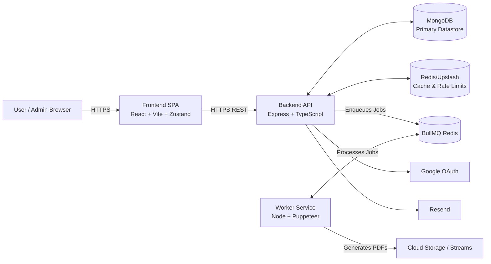

<div align="center">
  <h1>🚀 Resume Builder Platform (SaaS)</h1>
  <p><strong>A production-ready, highly scalable platform for crafting professional resumes with AI-driven ATS optimization.</strong></p>
</div>

---

## 📖 Overview

Resume Builder is an enterprise-grade SaaS application designed to help users create, manage, and optimize their resumes. It provides real-time AI suggestions, a robust template engine, and a scalable background processing pipeline for exporting pixel-perfect PDFs via headless browsers.

This project uses a modern **Three-Tier Architecture**:
1. **Frontend (React/Vite)**: A snappy Single Page Application for the client interface.
2. **Backend API (Node/Express)**: A hardened REST API handling business logic, authentication, and orchestration.
3. **Worker Service (BullMQ/Puppeteer)**: A dedicated job processor for high-resource tasks like PDF generation and AI/ATS analysis.

---

## 🏗 Architecture



### Core Responsibilities
- **Frontend**: State management (Zustand), UI components (shadcn/ui), client-side validation, PDF preview generation.
- **Backend**: JWT/Cookie Auth with Refresh rotation, CSRF protection, route-based rate-limiting, Zod request validation, distributed caching.
- **Worker**: Asynchronous PDF rendering, ATS scoring, and LLM text generation decoupled from the main API thread.

---

## 🚀 Quick Start (Local Development)

### Prerequisites
- Node.js (v20+ recommended)
- MongoDB (local or Atlas)
- Redis (local or Upstash)
- Docker (optional, for simplified infrastructure)

### 1. Database & Cache
You can run the necessary infrastructure locally using Docker:
```bash
docker-compose up -d
```
*This starts MongoDB and Redis locally.*

### 2. Backend API
```bash
cd Backend
npm install
# Copy the env file and fill in required values
cp .env.example .env 
npm run dev
```

### 3. Frontend SPA
```bash
cd frontend
npm install
# Copy the env file and set VITE_API_BASE_URL=http://localhost:5000
cp .env.example .env 
npm run dev
```

### 4. Background Worker
```bash
cd worker
npm install
cp .env.example .env
npm run dev
```

---

## ⚙️ Environment Variables

### Backend (`Backend/.env`)
| Variable | Description |
|----------|-------------|
| `NODE_ENV` | Environment (`development`, `production`) |
| `PORT` | API Server Port (Default: 5000) |
| `MONGO_URI` | MongoDB Connection String |
| `REDIS_URL` | Redis connection URL for caching and queues |
| `FRONTEND_URL` | Allowed CORS origin (e.g., `http://localhost:5173`) |
| `JWT_ACCESS_SECRET` | Secret key for access tokens |
| `JWT_REFRESH_SECRET`| Secret key for refresh tokens |
| `GOOGLE_CLIENT_ID` | OAuth Client ID for Google Auth |
| `RESEND_API_KEY` | Resend key for transactional emails |

### Worker (`worker/.env`)
| Variable | Description |
|----------|-------------|
| `MONGO_URI` | Must match backend |
| `REDIS_URL` | Must match backend |
| `PUPPETEER_SKIP_CHROMIUM_DOWNLOAD` | Set to `true` if using a system-installed Chrome |

### Frontend (`frontend/.env`)
| Variable | Description |
|----------|-------------|
| `VITE_API_BASE_URL` | Backend URL (`http://localhost:5000` locally) |
| `VITE_GOOGLE_CLIENT_ID` | OAuth Client ID |

---

## 🧪 Testing

We employ a comprehensive testing strategy across unit, integration, and E2E boundaries.

```bash
# Run all automated tests (Unit & Integration)
cd Backend
npm run test:ci

# Run specific integration tests
npm run test:integration

# Manual verification scripts
npm run test:rate-limit:login
npm run test:cache:templates
```

### Test Coverage Breakdown
- **Unit Tests**: Coverage for security middleware (CSRF, Auth), token generation, validation schemas, and cookie parsing.
- **Integration Tests**: Coverage for application factory health checks and end-to-end API routes.
- **Manual QA Scripts**: Included in `Backend/manual-tests/` for validating Redis caching behaviors and Rate Limit drop-offs.

---

## 🛡️ Production Readiness & Security

This application has been hardened for production deployment:

1. **Strict CORS & Helmet**: Mitigates XSS and restricts API access to authorized frontends.
2. **CSRF Protection**: All state-changing mutations (`POST`, `PUT`, `DELETE`) require a valid `X-CSRF-Token` header mapped to a secure, HTTP-only cookie.
3. **Rate Limiting**: Auth routes (login, signup, reset) are strictly rate-limited using a Redis sliding window to prevent brute force and credential stuffing.
4. **Zod Validation**: 100% of incoming payloads are validated at the middleware level before touching business logic.
5. **Graceful Shutdown**: SIGINT/SIGTERM handlers are implemented on the Backend and Worker to drain active connections and jobs before exiting safely.
6. **Distributed Caching**: High-traffic read routes (`/api/templates`) utilize Redis to serve <10ms responses. Cache is smartly invalidated upon mutations.
7. **Observability**: OpenTelemetry instrumentation is ready for tracing, and Prometheus metrics are exposed at `/metrics`.

---

## 📦 Deployment Guide

### Recommended Stack
- **Frontend**: Vercel or Netlify (Zero-config React/Vite deployment)
- **Backend API**: Render, Railway, or AWS ECS. 
- **Worker**: Railway or AWS ECS (needs sufficient RAM for headless Chrome/Puppeteer).
- **Database**: MongoDB Atlas
- **Cache**: Upstash (Serverless Redis)

### Pre-Flight Checklist
1. Ensure `NODE_ENV=production` across all services.
2. Confirm frontend URL is explicitly set in `FRONTEND_URL` and `FRONTEND_URLS`.
3. Set secure, high-entropy strings for `JWT_*_SECRET`.
4. Implement a Keep-Alive ping (e.g., UptimeRobot) against `/api/health` to prevent PaaS instances from cold-booting on first requests.

---

## 🛑 Troubleshooting

### Puppeteer Crashing in Worker
- **Symptom**: Jobs are failing with `Protocol error (Target.createTarget): Target closed.`
- **Fix**: Ensure your worker environment has at least 1GB of RAM. In Docker, ensure `--no-sandbox` flags are passed to Puppeteer if running as root.

### Cache Stampede / Missing Cache
- **Symptom**: Templates route feels slow despite caching.
- **Fix**: Verify `REDIS_URL` is correct. If the Redis server is unreachable, the application is designed to **fail open** (bypass cache) to keep the app online, but performance will degrade. Check your logs for Redis connection errors.

### Invalid CSRF Token Error
- **Symptom**: `403 Forbidden - Invalid CSRF Token`.
- **Fix**: Ensure the frontend is passing `withCredentials: true` via Axios to send the HTTP-only cookie, and that the `X-CSRF-Token` header matches the payload requested via `GET /api/auth/csrf`.
