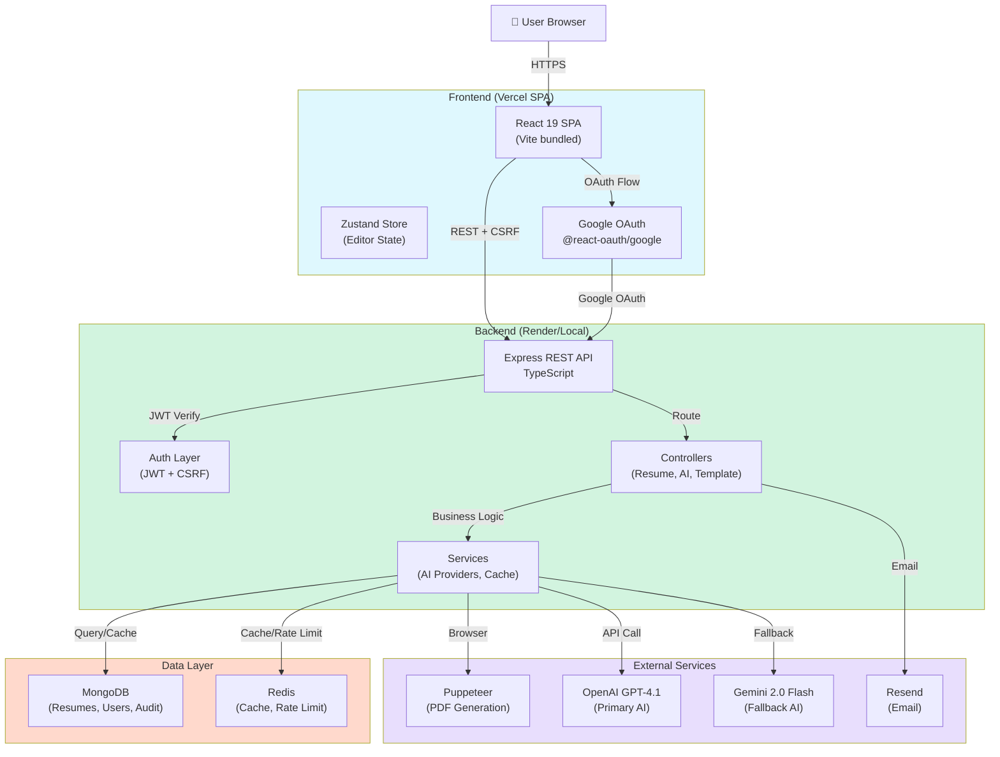

# ResumeStudio

**ATS-verified resume builder with AI-powered content enhancement, live preview, and pixel-perfect PDF export.**

[](https://www.typescriptlang.org/)
[](https://react.dev/)
[](https://expressjs.com/)
[](https://www.mongodb.com/)
[](https://redis.io/)
[](https://opensource.org/licenses/MIT)
[](https://www.docker.com/)

---

## 🎯 What is ResumeStudio?

ResumeStudio is a full-stack SaaS platform that transforms how job seekers build and optimize their resumes. Combining a structured editor with 12 professionally designed templates, an AI writing assistant, and an ATS scoring engine, it delivers production-ready resumes optimized for both applicant tracking systems and human readers.

**Perfect for:** Job seekers, career changers, and professionals seeking ATS compliance and recruitment-friendly resume formatting.

**Key value propositions:**
- 🚀 **AI-Enhanced Content** — Grammar checking, text improvement, and bullet-point enhancement
- 📊 **ATS Scoring** — Real-time analysis against job descriptions with actionable suggestions
- 🎨 **12 Templates** — Professional HTML-based designs covering tech, creative, and corporate industries
- ⚡ **Live Preview** — Instant visual feedback as you type
- 📄 **Pixel-Perfect PDFs** — Server-side generation ensuring consistent rendering across devices
- 🔒 **Enterprise Security** — CSRF protection, JWT auth, account lockout, audit logging

---

## 📋 Table of Contents

- [Features](#-features)
- [Tech Stack](#-tech-stack)
- [Architecture](#-architecture-overview)
- [Screenshots](#-screenshots--demo)
- [Quick Start](#-quick-start)
- [Development Setup](#-development-setup)
- [Environment Variables](#-environment-variables)
- [API Documentation](#-api-documentation)
- [Deployment](#-deployment)
- [Testing](#-testing)
- [Database Schema](#-database-schema)
- [Observability](#-observability--monitoring)
- [Contributing](#-contributing)
- [License](#-license)

---

## 📸 Screenshots & Demo

### Live Preview Interface
```
┌─────────────────────────────────────────────────────┐
│ ResumeStudio Editor                                 │
├─────────────────────────────────────────────────────┤
│  [Personal Info] [Experience] [Education] [Skills]  │
│                                                     │
│  ┌──────────────────┐  ┌────────────────────────┐  │
│  │ Editor Panel     │  │ Live Preview (Real     │  │
│  │                  │  │ HTML DOM rendering)    │  │
│  │ • Full Name      │  │                        │  │
│  │ • Email/Phone    │  │ [Resume Preview]       │  │
│  │ • + Add Section  │  │ Updates in Real-time   │  │
│  │                  │  │                        │  │
│  └──────────────────┘  └────────────────────────┘  │
│  ┌──────────────────────────────────────────────┐  │
│  │ AI Assistant Panel    │ ATS Analysis Results │  │
│  │ ✨ Improve Text       │ Score: 87/100        │  │
│  │ 📝 Check Grammar      │ Keywords Found: 15   │  │
│  │ 💡 Enhance Bullets    │ Missing: 3           │  │
│  └──────────────────────────────────────────────┘  │
└─────────────────────────────────────────────────────┘
```

### Demo & Deployment
- **Live URL:** [Deploy to Render or Vercel](#deployment)
- **Local Preview:** `npm run dev` (see [Development Setup](#-development-setup))
- **Docker Compose:** Full local stack in seconds (see [Quick Start](#-quick-start))

---

## ✨ Features

### Core Features

| Feature | Description |
|---------|-------------|
| **Multi-Section Editor** | Structured forms for personal info, experience, education, skills, projects, certifications, and languages |
| **Live Preview Engine** | Real-time DOM rendering with instant style updates as you type |
| **12 HTML Templates** | Professional layouts: Classic, Executive, Modern, Compact, Sidebar, Scholarly, Research, Chronological, Functional, Combination, Traditional, Community |
| **Template Switching** | Change designs without losing content; style customizations merge intelligently |
| **Visual Customization** | Font families, sizes, colors, margins, spacing, bullet styles, header alignment |
| **Drag-Free Interface** | Structured tabbed editor (mobile-ready without drag-and-drop complexity) |
| **Completion Score** | Progress indicator showing resume professionalism and completeness |
| **Section Visibility Toggles** | Show/hide sections without deleting content |

### Advanced Features

| Feature | Description |
|---------|-------------|
| **AI Writing Assistant** | Context-aware text improvement, grammar correction, and bullet-point enhancement using OpenAI GPT-4.1 or Gemini 2.0 Flash |
| **ATS Analysis Engine** | Full resume scoring against job descriptions: keyword gaps, section audits, action plans, priority-level suggestions, and estimated post-fix scores |
| **AI Provider Fallback** | Seamless fallback from primary (OpenAI) to secondary (Gemini) if rate-limited or timeout occurs |
| **Request Deduplication** | Identical AI requests within 5–10 minutes return cached results without credit deduction |
| **Multi-Factor Authentication (TOTP)** | Two-factor auth with backup codes for enhanced account security |
| **Resume Version History** | Automatic version snapshots on each save with full restore capability |
| **Async PDF Generation** | Server-side Puppeteer rendering with status polling and Server-Sent Events (SSE) streaming |
| **Admin Dashboard** | Usage analytics, template performance metrics, most/least-used templates, compliance reporting |
| **Audit Trail** | Complete create/update/delete logs with TTL-based retention for compliance |

### Security Features

| Feature | Description |
|---------|-------------|
| **CSRF Protection** | Double-submit cookie pattern with automatic token rotation |
| **JWT Authentication** | HTTP-only access + refresh token pair with configurable TTL |
| **Password Security** | Bcrypt hashing with progressive account lockout after failed attempts |
| **Input Validation** | Zod schemas with XSS sanitization on all inputs |
| **Security Headers** | Helmet.js with CSP, HSTS, X-Frame-Options optimized for OAuth |
| **Rate Limiting** | Redis-backed sliding-window limiting (login, registration, AI requests, password reset) |
| **Token Blacklist** | Redis-cached token invalidation on logout |
| **Referential Integrity** | Automated validation of foreign key constraints before mutations |
| **Request Deduplication** | Prevents duplicate AI/API requests from inflight collisions |
| **Soft Deletes** | Non-destructive deletion with 30-day recovery window |
| **Cascade Deletes** | Automatic cleanup of child documents (e.g., User → Resume, AiUsage) |

### Performance Features

| Feature | Description |
|---------|-------------|
| **Redis Caching** | Template listings, analytics, dashboard data with configurable TTL (600s public, 180s admin) |
| **In-Memory Cache Fallback** | Optional zero-dependency caching when Redis is unavailable |
| **Database Indexes** | Compound indexes on high-traffic queries (user resumés, template listings) |
| **Lazy-Loaded Routes** | React pages split via dynamic imports for smaller initial bundles |
| **Puppeteer Browser Pool** | Reusable Chromium instances for efficient PDF generation |
| **Connection Pooling** | MongoDB pool (10–100) tuned for concurrent workloads |
| **Request Timeout Middleware** | Configurable limits (30s standard, 120s for PDF routes) |
| **Compression** | Gzip middleware for response optimization |

### Developer Features

| Feature | Description |
|---------|-------------|
| **OpenAPI 3.0 Docs** | Auto-generated API documentation at `/api/docs` |
| **Prometheus Metrics** | Built-in metrics endpoint with AI, compliance, and uptime counters |
| **OpenTelemetry Integration** | Distributed tracing across HTTP, Express, and MongoDB operations |
| **Sentry Error Tracking** | Client and server error capture with user context and PII redaction |
| **Structured Logging (Pino)** | JSON logs with correlation IDs, request tracking, and Loki push support |
| **Health Check Endpoints** | Deep health checks with component-level status (MongoDB, Redis, queue) |
| **Development Modes** | Hot-reload with `ts-node`, TypeScript compilation, PM2 ecosystem support |
| **E2E Testing** | Playwright test suite for critical user flows |
| **Docker & Render Support** | One-click deployment with `render.yaml` and Docker Compose for local dev |

---

## 🛠️ Tech Stack

### Frontend

| Layer | Technologies |
|-------|--------------|
| **Framework** | React 19.2, TypeScript 5.9 |
| **Build Tool** | Vite 8.0 |
| **Routing** | React Router 7.13 (lazy-loaded pages) |
| **State Management** | Zustand 5.0 (resume editor state) |
| **Styling** | Tailwind CSS 4.2, shadcn/ui, Radix UI |
| **Animations** | Framer Motion 12.38 |
| **HTTP Client** | Axios 1.13 with auto-refresh + retry |
| **PDF (Client)** | html2canvas 1.4 + jsPDF 4.2 (fallback) |
| **Icons** | Lucide React 1.0 |
| **OAuth** | @react-oauth/google 0.13 |
| **Error Tracking** | Sentry React 10.22 |
| **Testing** | Vitest 4.1, Playwright 1.59 |

### Backend

| Layer | Technologies |
|-------|--------------|
| **Runtime** | Node.js 20+ |
| **Framework** | Express 5.2, TypeScript 5.9 |
| **Database (ORM)** | MongoDB 7.0, Mongoose 9.3 |
| **Cache / Rate Limit** | Redis 7 (Upstash REST or self-hosted via ioredis 5.8) |
| **PDF Generation** | Puppeteer 24.43 (Chromium) |
| **Request Validation** | Zod 4.3 |
| **Authentication** | jsonwebtoken 9.0, bcrypt 6.0, Google Auth Library 10.6 |
| **Input Sanitization** | isomorphic-dompurify 3.14 |
| **Email** | Resend 4.0 (transactional) |
| **Observability** | OpenTelemetry SDK 0.214, Prometheus 15.1, Pino 10.3, Sentry Node 10.22 |
| **Security** | Helmet 8.1 (CSP, HSTS, etc.) |
| **Compression** | compression 1.7 (gzip middleware) |
| **Logging** | Pino 10.3, pino-http 11.0 |
| **Testing** | Node native test runner, MongoDB Memory Server 10.2 |

### Deployment & Infrastructure

| Component | Technology |
|-----------|-----------|
| **Frontend Hosting** | Vercel (static SPA) |
| **Backend Hosting** | Render (Node.js service) |
| **Database** | MongoDB Cloud (Atlas) or self-hosted |
| **Cache** | Upstash Redis (REST API) or self-hosted Redis |
| **Observability** | Grafana Cloud (Prometheus, Loki), Sentry |
| **Containerization** | Docker, Docker Compose |
| **API Gateway** | None (direct Express routes) |
| **Message Queue** | BullMQ (shimmed to run synchronously for PDF/ATS) |

---

## 🏗️ Architecture Overview

### System Design

ResumeStudio follows a **multi-tier SPA + REST API** architecture:



### Data Flow Example: Resume Download

```
User clicks "Download PDF"
    ↓
Frontend: POST /api/resumes/:id/download
    ↓
Backend: authMiddleware → validateRequest → resumeDownloadController
    ↓
Enqueue PDF job (synchronously executed via BullMQ shim)
    ↓
Puppeteer: Render resume HTML → PDF binary
    ↓
Store in ResumeDownloadJob collection
    ↓
Frontend: Poll or SSE stream status
    ↓
Job complete → Serve PDF from download endpoint
    ↓
User: Resume.pdf downloaded ✅
```

### Data Flow Example: ATS Analysis

```
User selects job description + clicks "Analyze for ATS"
    ↓
Frontend: POST /api/resumes/:id/analyze-ats
    ↓
Backend: authMiddleware → creditDeduction → requestDedup → aiValidation
    ↓
Check if same resume/job already analyzed (deduplicate)
    ↓
Call AI provider with enhanced ATS prompt
    ↓
Parse response → Extract scores, keywords, suggestions
    ↓
Deduct AI credits → Store analysis in AtsAnalysis collection
    ↓
Return results to frontend (scores, keyword matches, action plan)
    ↓
User sees ATS score + suggestions ✅
```

### Folder Structure

```
resume-builder/
├── Backend/                          # Express REST API (Node.js / TypeScript)
│   ├── src/
│   │   ├── app.ts                   # Express app factory
│   │   ├── server.ts                # Entry point (DB connect, graceful shutdown)
│   │   ├── instrumentation.ts       # OpenTelemetry SDK bootstrap
│   │   ├── controllers/             # Request handlers (auth, resume, AI, admin)
│   │   ├── middleware/              # Express middleware stack
│   │   ├── models/                  # Mongoose schemas + plugins
│   │   ├── router/                  # Route modules (organized by domain)
│   │   ├── services/                # Business logic (AI providers, cache, etc.)
│   │   ├── queue/                   # BullMQ queue shims
│   │   ├── utils/                   # Utilities (tokens, cookies, email, etc.)
│   │   ├── config/                  # Configuration (env schema, DB, Sentry)
│   │   ├── errors/                  # Custom error classes
│   │   ├── events/                  # Event definitions
│   │   ├── observability/           # Monitoring (metrics, logging)
│   │   ├── validation/              # Zod schemas
│   │   └── types/                   # TypeScript type definitions
│   ├── automated-tests/             # 17 unit + integration tests
│   ├── prompts/                     # AI prompt templates (Python)
│   ├── deploy/                      # Deployment configs
│   └── Dockerfile                   # Multi-stage build (builder + runtime)
│
├── frontend/                         # React SPA (TypeScript)
│   ├── src/
│   │   ├── pages/                   # Route pages (ResumeBuilder, MyResume, Admin)
│   │   ├── components/              # React components (50+ organized by domain)
│   │   ├── hooks/                   # Custom hooks (useAISuggestions, useMyResume)
│   │   ├── store/                   # Zustand store (resume editor state)
│   │   ├── services/                # API client (Axios + CSRF)
│   │   ├── templates/               # 12 template React components
│   │   ├── types/                   # TypeScript type definitions
│   │   ├── utils/                   # Utilities (logger, PDF, print, etc.)
│   │   ├── data/                    # Static data (templates, sample resume)
│   │   └── __tests__/               # Frontend unit tests
│   ├── e2e/                         # Playwright E2E specs
│   └── Dockerfile                   # Nginx SPA server
│
├── shared/                           # Shared types (not published)
│   └── src/
│       ├── ai.ts                    # AI-related types
│       └── bullmq.ts                # BullMQ job schemas
│
├── docs/                             # Project documentation
│   ├── ARCHITECTURE.md              # This architecture
│   ├── TESTING_STANDARDS.md         # Testing conventions
│   └── features/                    # Feature docs (auth, AI, ATS, etc.)
│
├── docker-compose.yml               # Local dev: backend, frontend, mongo, redis
├── package.json                     # Root workspace (build, lint, test)
└── README.md                        # This file
```

---

## 🚀 Quick Start

### Prerequisites

- **Docker Desktop** (v2.0+) with at least 4GB RAM
- **Ports available:** 5000 (backend), 5173 (frontend), 27017 (MongoDB), 6379 (Redis)

### Start All Services

```bash
# Clone the repository
git clone https://github.com/yourusername/resume-builder.git
cd resume-builder

# Start all services (backend, frontend, MongoDB, Redis)
docker-compose up --build

# Services will be available at:
# Frontend: http://localhost:5173
# Backend API: http://localhost:5000/api
# Health Check: http://localhost:5000/health
# Prometheus Metrics: http://localhost:5000/metrics
```

### Stop Services

```bash
# Stop all services
docker-compose down

# Stop and remove volumes (reset database)
docker-compose down -v
```

### View Logs

```bash
# All services
docker-compose logs -f

# Specific service
docker-compose logs -f backend
docker-compose logs -f frontend
docker-compose logs -f mongo
docker-compose logs -f redis
```

---

## 💻 Development Setup

### Prerequisites

- **Node.js 20+** with npm
- **MongoDB** (local or Atlas URI)
- **Redis** (optional; in-memory fallback available)
- **Environment variables** configured (see [Environment Variables](#-environment-variables))

### Backend Setup

```bash
cd Backend

# Install dependencies
npm install

# Build TypeScript
npm run build

# Run in development mode (with hot-reload via ts-node)
npm run dev

# Run tests
npm run test

# Run specific test suite
npm run test:unit
npm run test:integration
npm run test:vitest
```

**Backend runs on:** `http://localhost:5000`

### Frontend Setup

```bash
cd frontend

# Install dependencies
npm install

# Run development server with hot module replacement
npm run dev

# Build for production
npm run build

# Run tests
npm run test

# Run E2E tests
npm run test:e2e

# Format code
npm run lint
```

**Frontend runs on:** `http://localhost:5173`

### Root Scripts

```bash
# From project root
npm run build       # Build both backend and frontend
npm run lint        # Lint frontend
npm run test        # Test both tiers
npm run verify      # lint + build + test (CI workflow)
```

---

## 🔐 Environment Variables

### Backend Configuration

Create `Backend/.env` with the following:

```env
# ─── Core Server ─────────────────────────
NODE_ENV=development
PORT=5000
LOG_LEVEL=info

# ─── Database & Cache ────────────────────
MONGO_URI=mongodb://localhost:27017/resume_builder_dev
REDIS_URL=redis://localhost:6379/0
USE_MEMORY_ONLY_CACHE=false  # Use in-memory cache if Redis unavailable

# ─── Frontend URLs ───────────────────────
FRONTEND_URL=http://localhost:5173
FRONTEND_URLS=http://localhost:5173,http://localhost:5000
ALLOW_PREVIEW_ORIGINS=true

# ─── JWT Secrets (Generate with: openssl rand -base64 32) ──
JWT_ACCESS_SECRET=your_access_token_secret_here
JWT_REFRESH_SECRET=your_refresh_token_secret_here

# ─── Authentication ──────────────────────
GOOGLE_CLIENT_ID=your_google_client_id
GOOGLE_CLIENT_SECRET=your_google_client_secret

# ─── AI Providers ────────────────────────
OPENAI_API_KEY=sk-...
OPENAI_MODEL=gpt-4-1106-preview

GEMINI_API_KEY=your_gemini_api_key
GEMINI_MODEL=gemini-2.0-flash

# ─── Email (Resend) ──────────────────────
RESEND_API_KEY=re_...
RESEND_FROM=noreply@example.com

# ─── Observability ──────────────────────
SENTRY_DSN=https://...@....ingest.sentry.io/...
SENTRY_ENVIRONMENT=development
SENTRY_TRACES_SAMPLE_RATE=0.1

ENABLE_METRICS=true
METRICS_PATH=/metrics

# OpenTelemetry (optional)
OTEL_EXPORTER_OTLP_ENDPOINT=http://localhost:4317

# ─── Rate Limiting ───────────────────────
RATE_LIMIT_WINDOW_MS=900000           # 15 minutes
RATE_LIMIT_MAX_REQUESTS=100           # per window
RATE_LIMIT_LOGIN_MAX=5                # login attempts
RATE_LIMIT_AI_MAX=30                  # AI requests per day
RATE_LIMIT_PDF_MAX=20                 # PDF downloads per hour

# ─── AI Credits ──────────────────────────
AI_CREDITS_PER_USER=100               # Initial credits
AI_CREDIT_COST_IMPROVE_TEXT=1
AI_CREDIT_COST_CHECK_GRAMMAR=1
AI_CREDIT_COST_ENHANCE_BULLET=1
AI_CREDIT_COST_ANALYZE_ATS=5
ENFORCE_AI_CREDITS=false              # Warn if false, block if true

# ─── PDF Generation ──────────────────────
PUPPETEER_HEADLESS=true
PUPPETEER_TIMEOUT_MS=30000
PDF_MAX_CONCURRENT_JOBS=3

# ─── File Upload ─────────────────────────
MAX_UPLOAD_SIZE=5242880               # 5MB

# ─── Features ────────────────────────────
ENABLE_MFA=true
ENABLE_ADMIN_DASHBOARD=true
ENABLE_ATS_ANALYSIS=true
```

### Frontend Configuration

Create `frontend/.env.local` with the following:

```env
# ─── API Endpoint ─────────────────────────
VITE_API_BASE_URL=http://localhost:5000/api

# ─── Frontend Base ────────────────────────
VITE_BASE_URL=http://localhost:5173

# ─── OAuth ────────────────────────────────
VITE_GOOGLE_CLIENT_ID=your_google_client_id

# ─── Observability (Optional) ─────────────
VITE_SENTRY_DSN=https://...@....ingest.sentry.io/...
VITE_SENTRY_ENVIRONMENT=development
VITE_SENTRY_TRACES_SAMPLE_RATE=0.1

# ─── Feature Flags ────────────────────────
VITE_ENABLE_AI_FEATURES=true
VITE_ENABLE_MFA=true
```

### Generate JWT Secrets

```bash
# Linux/macOS
openssl rand -base64 32

# Windows (PowerShell)
[Convert]::ToBase64String((1..32 | ForEach-Object { Get-Random -Max 256 }))
```

---

## 📡 API Documentation

### Authentication Endpoints

| Method | Route | Auth | Description |
|--------|-------|------|-------------|
| **POST** | `/api/auth/signup` | No | Register new account (email/password) |
| **POST** | `/api/auth/login` | No | Login with credentials (rate-limited) |
| **POST** | `/api/auth/google-login` | No | Login via Google OAuth |
| **POST** | `/api/auth/logout` | Yes | Logout and blacklist refresh token |
| **GET** | `/api/auth/me` | Yes | Get authenticated user profile |
| **POST** | `/api/auth/forgot-password` | No | Request password reset email |
| **POST** | `/api/auth/reset-password` | No | Reset password with token |
| **GET** | `/api/refresh/csrf` | No | Issue CSRF token |
| **POST** | `/api/refresh` | No | Refresh access token |

### Resume Endpoints

| Method | Route | Auth | Description |
|--------|-------|------|-------------|
| **GET** | `/api/resumes` | Yes | List user's resumes |
| **POST** | `/api/resumes` | Yes | Create new resume |
| **GET** | `/api/resumes/:id` | Yes | Get resume by ID |
| **PUT** | `/api/resumes/:id` | Yes | Update resume content |
| **DELETE** | `/api/resumes/:id` | Yes | Soft-delete resume |
| **POST** | `/api/resumes/:id/restore` | Yes | Restore deleted resume |
| **POST** | `/api/resumes/:id/download` | Yes | Enqueue PDF download job |
| **GET** | `/api/resumes/downloads/:jobId` | Yes | Poll download status |
| **GET** | `/api/resumes/downloads/:jobId/stream` | Yes | SSE stream job updates |

### AI Endpoints

| Method | Route | Auth | Description |
|--------|-------|------|-------------|
| **POST** | `/api/ai/improve-text` | Yes | Rewrite/improve text (1 credit) |
| **POST** | `/api/ai/check-grammar` | Yes | Check grammar (1 credit) |
| **POST** | `/api/ai/enhance-bullet` | Yes | Enhance bullet point (1 credit) |
| **POST** | `/api/resumes/:id/analyze-ats` | Yes | Analyze ATS compatibility (5 credits) |
| **GET** | `/api/ai/usage-stats` | Yes | Get AI usage statistics |
| **GET** | `/api/ai/request-history` | Yes | Get AI request history (paginated) |

### Template Endpoints

| Method | Route | Auth | Description |
|--------|-------|------|-------------|
| **GET** | `/api/templates` | No | List published templates (cached) |
| **GET** | `/api/admin/templates` | Admin | List all templates |
| **GET** | `/api/admin/templates/:id` | Admin | Get template details |
| **POST** | `/api/admin/templates` | Admin | Create template |
| **PUT** | `/api/admin/templates/:id` | Admin | Update template |
| **PATCH** | `/api/admin/templates/:id/status` | Admin | Publish/unpublish |
| **PUT** | `/api/admin/templates/reorder` | Admin | Reorder template list |
| **DELETE** | `/api/admin/templates/:id` | Admin | Delete template |

### Admin Endpoints

| Method | Route | Auth | Description |
|--------|-------|------|-------------|
| **GET** | `/api/admin/dashboard` | Admin | Dashboard analytics (cached) |
| **GET** | `/api/admin/audit-logs` | Admin | Compliance audit logs |
| **GET** | `/api/admin/integrity-check` | Admin | Data integrity report |
| **GET** | `/api/compliance/audit-export` | Admin | Export audit logs (CSV) |

### Health & Monitoring

| Method | Route | Auth | Description |
|--------|-------|------|-------------|
| **GET** | `/health` | No | Basic health check (200/503) |
| **GET** | `/health/deep` | No | Deep health (MongoDB + Redis) |
| **GET** | `/health/uptime` | No | Service uptime and SLA status |
| **GET** | `/health/metrics` | No | Prometheus metrics (uptime registry) |
| **GET** | `/metrics` | Yes | Full Prometheus metrics |

### Request/Response Examples

#### Create Resume

```bash
curl -X POST http://localhost:5000/api/resumes \
  -H "Content-Type: application/json" \
  -H "X-CSRF-Token: $CSRF_TOKEN" \
  -H "Cookie: access_token=$ACCESS_TOKEN" \
  -d '{
    "templateId": "modern",
    "personalInfo": {
      "fullName": "Jane Doe",
      "email": "jane@example.com",
      "phone": "+1 (555) 123-4567",
      "location": "San Francisco, CA",
      "summary": "Full-stack engineer with 5 years experience..."
    },
    "sections": {
      "experience": [
        {
          "company": "Tech Corp",
          "position": "Senior Engineer",
          "startDate": "2021-01",
          "endDate": "present",
          "bullets": ["Led team of 5 engineers", "Shipped feature X"]
        }
      ]
    }
  }'
```

#### Improve Text with AI

```bash
curl -X POST http://localhost:5000/api/ai/improve-text \
  -H "Content-Type: application/json" \
  -H "X-CSRF-Token: $CSRF_TOKEN" \
  -d '{
    "text": "I worked on a project",
    "context": "experience"
  }'
```

#### Analyze ATS Score

```bash
curl -X POST http://localhost:5000/api/resumes/:id/analyze-ats \
  -H "Content-Type: application/json" \
  -H "X-CSRF-Token: $CSRF_TOKEN" \
  -d '{
    "jobDescription": "Senior Software Engineer required...",
    "jobTitle": "Senior Software Engineer"
  }'
```

---

## 🚢 Deployment

### Deploy to Render (Backend)

1. **Connect repository** to Render dashboard
2. **Set environment variables** (see [Environment Variables](#-environment-variables))
3. **Deploy:**
   - Build command: `npm install && npx puppeteer browsers install chrome && npm run build`
   - Start command: `npm start`
   - Port: `5000`

**Pre-configured:** See `Backend/render.yaml` for one-click deployment.

```bash
# Deploy via Render CLI
render deploy
```

### Deploy to Vercel (Frontend)

1. **Connect repository** to Vercel dashboard
2. **Root directory:** `frontend`
3. **Build command:** `npm run build`
4. **Start command:** `npm run preview`
5. **Environment variables:**
   - `VITE_API_BASE_URL=https://your-backend.onrender.com/api`
   - `VITE_GOOGLE_CLIENT_ID=your_client_id`

### Docker Compose (Local Development)

```bash
docker-compose up --build

# Rebuild specific service
docker-compose up --build backend

# View logs
docker-compose logs -f

# Stop all services
docker-compose down

# Reset database
docker-compose down -v
```

### Production Checklist

- [ ] Environment variables configured in production
- [ ] MongoDB Atlas cluster created with IP allowlist
- [ ] Redis instance running (Upstash or self-hosted)
- [ ] Puppeteer Chrome pre-installed on server
- [ ] SSL/TLS certificates configured
- [ ] CORS origins whitelisted
- [ ] Rate limiting thresholds tuned
- [ ] Sentry project created for error tracking
- [ ] Prometheus + Grafana dashboards set up
- [ ] Backup strategy configured (MongoDB, Redis)
- [ ] Health check monitoring enabled
- [ ] Logs aggregation (Loki, Datadog, etc.) configured

---

## 🧪 Testing

### Backend Tests

```bash
cd Backend

# Run all tests
npm run test

# Unit tests only
npm run test:unit

# Integration tests only
npm run test:integration

# Watch mode (Vitest)
npm run test:vitest:watch

# Manual test scripts
npm run test:rate-limit:login
npm run test:rate-limit:forgot-password
npm run test:cache:templates
npm run test:download:prod
```

**Test files:** `Backend/automated-tests/*.test.js` and `Backend/automated-tests/integration/*.test.js`

### Frontend Tests

```bash
cd frontend

# Run all tests
npm run test

# Watch mode
npm run test:watch

# E2E tests (Playwright)
npm run test:e2e
```

**Test files:** `frontend/src/__tests__/*.test.ts` and `frontend/e2e/*.spec.ts`

### Testing Standards

See [TESTING_STANDARDS.md](docs/TESTING_STANDARDS.md) for:
- File naming conventions
- Test file anatomy (Arrange-Act-Assert pattern)
- Mocking rules
- Coverage requirements (80% minimum)
- Forbidden patterns

**Key rules:**
- All external API calls must be mocked
- Every public function needs 3 tests: happy path, edge case, error case
- Minimum 80% line coverage per module

---

## 🗄️ Database Schema

### Collections Overview

| Collection | Purpose | TTL | Key Fields |
|-----------|---------|-----|-----------|
| `users` | User accounts & auth | — | email, passwordHash, googleId, role, aiCredits |
| `resumes` | Resume documents | soft-delete | userId, templateId, personalInfo, sections, style |
| `templates` | Resume templates | — | layoutId, cssVars, status, sortOrder |
| `ats_analyses` | ATS analysis results | — | resumeId, jobId, scores, keywordAnalysis |
| `ai_usages` | AI request tracking | — | userId, feature, tokensUsed, cost, success |
| `audit_logs` | Compliance audit trail | 1 year | collection, document, action, user, changes |
| `resume_versions` | Version snapshots | — | resumeId, version, snapshot, createdAt |
| `template_usages` | Template analytics | — | templateId, date, count |
| `resume_download_jobs` | PDF generation jobs | — | resumeId, status, pdfData, createdAt |
| `reset_tokens` | Password reset tokens | 24 hours | hashedToken, userId, expiresAt |
| `mfa_secrets` | TOTP backup codes | — | userId, secret, backupCodes |

### Key Indexes

```javascript
// Resumes
db.resumes.createIndex({ userId: 1, createdAt: -1 })
db.resumes.createIndex({ templateId: 1, status: 1 })

// ATS Analyses
db.ats_analyses.createIndex({ resumeId: 1, jobId: 1 }, { unique: true })

// AI Usage
db.ai_usages.createIndex({ userId: 1, createdAt: -1 })
db.ai_usages.createIndex({ feature: 1, success: 1 })

// Audit Logs
db.audit_logs.createIndex({ userId: 1, createdAt: -1 })
db.audit_logs.createIndex({ collection: 1, document: 1 })
```

---

## 📊 Observability & Monitoring

### Structured Logging (Pino)

All requests logged with correlation ID and detailed context:

```json
{
  "level": 30,
  "time": "2026-05-23T10:30:00Z",
  "pid": 1234,
  "hostname": "backend-server",
  "req": {
    "id": "550e8400-e29b-41d4-a716-446655440000",
    "method": "POST",
    "url": "/api/ai/improve-text",
    "headers": { "user-agent": "axios/1.13" },
    "remoteAddress": "127.0.0.1"
  },
  "res": {
    "statusCode": 200,
    "responseTime": 1234
  },
  "userId": "user-123",
  "feature": "ai-improve-text",
  "credits_deducted": 1,
  "msg": "AI request completed successfully"
}
```

### Prometheus Metrics

**Available at:** `http://localhost:5000/metrics`

Key metrics:
- `http_requests_total` — Total HTTP requests by method, route, status
- `http_request_duration_seconds` — Request latency histogram
- `ai_requests_total` — Total AI requests by feature and provider
- `ai_tokens_used_total` — Total tokens consumed
- `ai_fallback_count_total` — Fallback to secondary provider count
- `mongodb_operations_total` — MongoDB operation counts
- `cache_hits_total` / `cache_misses_total` — Cache hit ratio
- `users_total` — Total registered users
- `resumes_total` — Total resumes created
- `audit_logs_total` — Compliance audit entries
- `uptime_seconds` — Service uptime

### OpenTelemetry Tracing

Distributed traces exported to Grafana Cloud / Jaeger:

```env
OTEL_EXPORTER_OTLP_ENDPOINT=https://your-otel-collector.com:4317
```

Traces include:
- HTTP request spans (method, URL, status, duration)
- Express middleware spans
- MongoDB operation spans
- External API calls (OpenAI, Gemini)

### Sentry Error Tracking

**Frontend & Backend errors** captured with:
- User context (ID, email)
- Request context (method, URL, headers)
- PII redaction (passwords, tokens, API keys hidden)
- Source maps for stack traces
- Release tracking

```env
SENTRY_DSN=https://your-key@your-org.ingest.sentry.io/project-id
SENTRY_ENVIRONMENT=production
SENTRY_TRACES_SAMPLE_RATE=0.1  # 10% of transactions
```

### Health Checks

```bash
# Basic health (200/503)
curl http://localhost:5000/health

# Deep health with component status
curl http://localhost:5000/health/deep

# Response example:
{
  "status": "ok",
  "components": {
    "mongodb": { "status": "ok", "latency": 5 },
    "redis": { "status": "ok", "latency": 2 },
    "queue": { "status": "ok", "depth": 0 }
  },
  "uptime": 86400,
  "timestamp": "2026-05-23T10:30:00Z"
}
```

---

## 🔐 Security Best Practices

### Authentication Flow

1. **Signup/Login** → JWT issued (access + refresh token pair)
2. **CSRF Protection** → Double-submit cookie on every mutating request
3. **Token Refresh** → Automatic 401 → refresh flow
4. **Session Bootstrap** → GET /api/refresh on app load

### Password Security

- **Hashing:** bcrypt with salt rounds = 10
- **Storage:** Passwords never logged or exposed
- **Reset:** Token-based reset with 24h expiration
- **Lockout:** Progressive lockout after 5 failed attempts

### Input Validation

All inputs validated with Zod schemas:
- XSS sanitization via isomorphic-dompurify
- Length limits enforced (max 10,000 chars for text)
- Email format validation
- Type checking on structured data

### Rate Limiting

Redis-backed sliding-window limits:
- **Login:** 5 attempts per 15 minutes
- **Registration:** 3 attempts per 15 minutes
- **AI requests:** 30 per day per user
- **Password reset:** 3 per hour

### Audit Logging

All admin actions logged:
- User: Create, update, delete
- Resume: Publish, restore, soft-delete
- Template: Publish, reorder, delete
- Retention: 1 year TTL

---

## 🤝 Contributing

### Development Workflow

1. **Fork** the repository
2. **Create feature branch:** `git checkout -b feature/your-feature`
3. **Follow conventions:** See [TESTING_AND_DOCS_STANDARDS.md](docs/TESTING_AND_DOCS_STANDARDS.md)
4. **Write tests:** Minimum 80% coverage required
5. **Run verification:** `npm run verify` (lint + build + test)
6. **Commit:** `git commit -am "feat: describe your change"`
7. **Push:** `git push origin feature/your-feature`
8. **Pull Request:** Include test results and verification output

### Code Standards

- **TypeScript:** Strict mode enabled
- **Linting:** ESLint + Prettier
- **Testing:** Vitest (frontend), Node test runner (backend)
- **Commits:** Conventional Commits (feat, fix, docs, chore)
- **Coverage:** 80% minimum per module

### Running Verification

```bash
npm run verify

# Runs:
# 1. npm run lint      (ESLint)
# 2. npm run build     (TypeScript compilation)
# 3. npm run test      (All tests)
```

---

## 📄 License

This project is licensed under the **MIT License** — see [LICENSE](LICENSE) for details.

---

## 📞 Support & Resources

- **Issues:** [GitHub Issues](https://github.com/yourusername/resume-builder/issues)
- **Documentation:** See `/docs` folder
- **Architecture:** [ARCHITECTURE.md](docs/ARCHITECTURE.md)
- **Testing:** [TESTING_STANDARDS.md](docs/TESTING_STANDARDS.md)
- **Features:** See `/docs/features` for detailed feature documentation
- **Local Setup:** [DOCKER_LOCAL_SETUP.md](DOCKER_LOCAL_SETUP.md)

---

## 🚀 Quick Links

| Resource | Link |
|----------|------|
| **Live Demo** | [Deploy to production](#deployment) |
| **API Docs** | http://localhost:5000/api/docs |
| **Metrics** | http://localhost:5000/metrics |
| **Architecture** | [docs/ARCHITECTURE.md](docs/ARCHITECTURE.md) |
| **Testing** | [docs/TESTING_STANDARDS.md](docs/TESTING_STANDARDS.md) |
| **Docker Setup** | [DOCKER_LOCAL_SETUP.md](DOCKER_LOCAL_SETUP.md) |
| **Features** | [docs/features/](docs/features/) |

---

**Made with ❤️ by the ResumeStudio team**

**Last updated:** May 23, 2026
