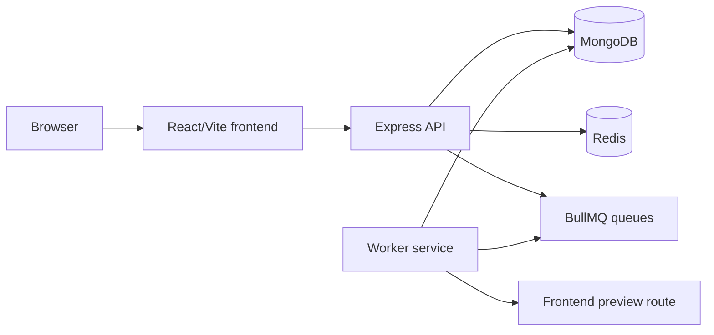

# Resume Builder Platform

A full-stack resume builder with authenticated resume management, template rendering, AI-assisted improvements, ATS analysis, and asynchronous PDF generation.

## Architecture

The project is split into four workspaces:

- `frontend`: React, Vite, TypeScript, Zustand, Tailwind, and Playwright E2E tests.
- `Backend`: Express, TypeScript, MongoDB, Redis-backed cache/rate limits, authentication, OpenAPI metadata, and observability.
- `worker`: BullMQ worker for PDF generation and ATS jobs, using Puppeteer for browser-based rendering.
- `shared`: Shared queue and AI contract types used by the backend and worker.



## Local Development

Prerequisites:

- Node.js 20+
- MongoDB
- Redis
- Docker, optional

Start infrastructure:

```bash
docker-compose up -d mongo redis
```

Install dependencies in each workspace:

```bash
cd Backend && npm install
cd ../frontend && npm install
cd ../worker && npm install
```

Create environment files from examples:

```bash
cp Backend/.env.example Backend/.env
cp frontend/.env.example frontend/.env
cp worker/.env.example worker/.env
```

Run services:

```bash
cd Backend && npm run dev
cd frontend && npm run dev
cd worker && npm run dev
```

## Verification

Backend:

```bash
cd Backend
npm run build
npm run test
```

Frontend:

```bash
cd frontend
npm run lint
npm run build
```

Worker:

```bash
cd worker
npm run build
```

## Production Notes

- Configure `FRONTEND_URL` so the worker can load `/resume/preview/:id` for pixel-matched PDF rendering.
- Keep `BULLMQ_REDIS_URL` available to both backend and worker.
- Use strong `JWT_ACCESS_SECRET` and `JWT_REFRESH_SECRET` values.
- Set `USE_MEMORY_ONLY_CACHE=false` in production when Redis or Upstash is configured.
- Optional observability exporters accept blank values; empty optional URLs are treated as disabled.

## Documentation

- Deployment notes: `DEPLOYMENT.md` and `DEPLOYMENT_GUIDE.md`
- Observability notes: `OBSERVABILITY_GUIDE.md`
- Historical implementation notes: `docs/archive`
