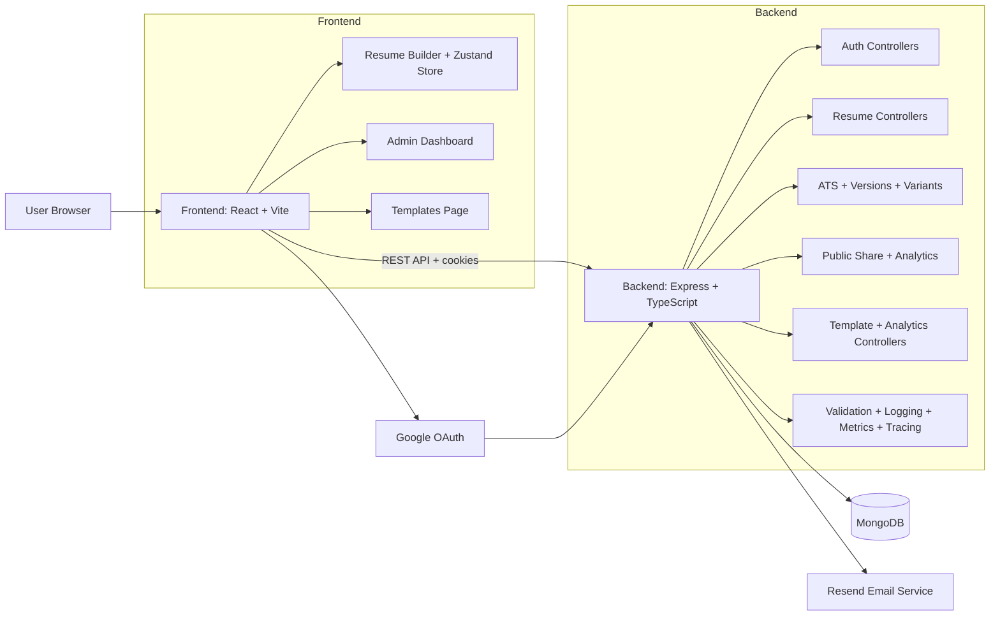
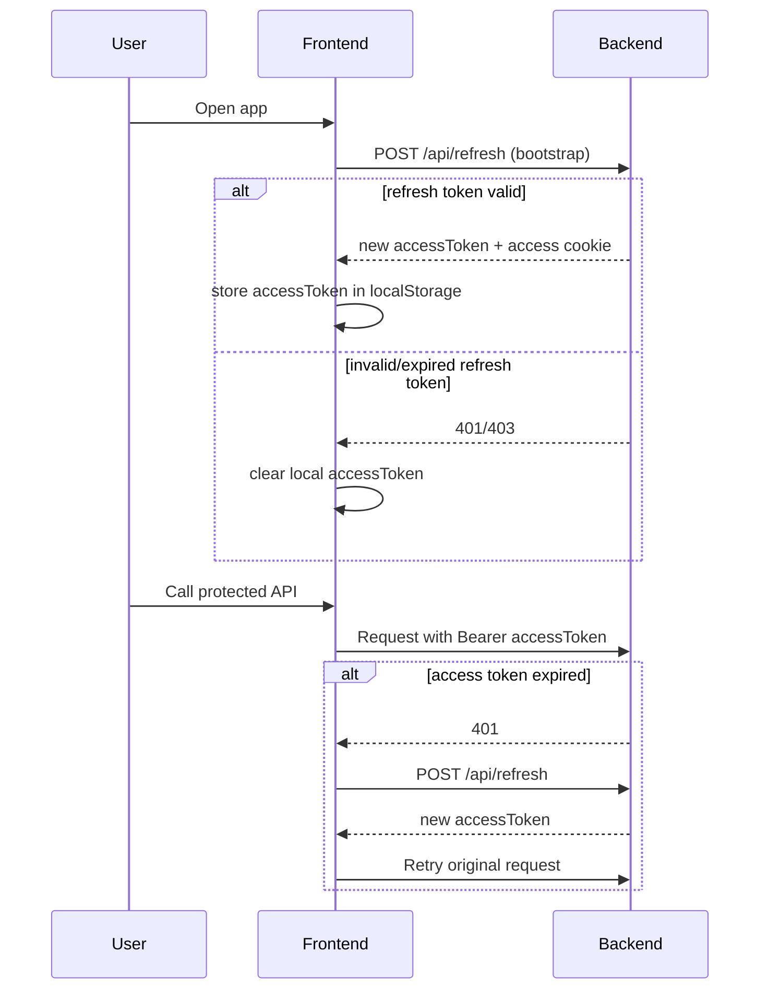
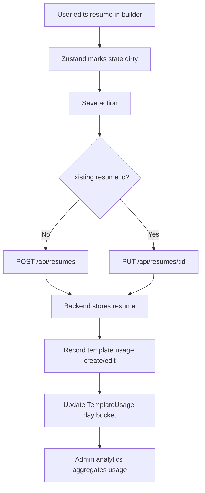
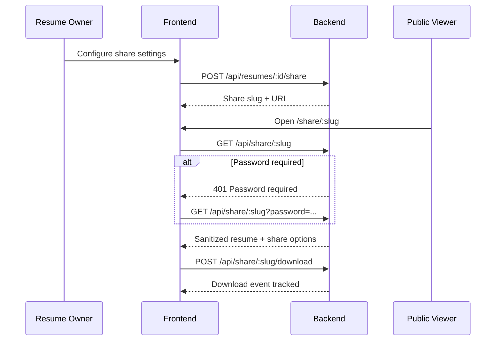

# Resume Builder SaaS

A full-stack resume builder platform with authentication, resume creation/editing, ATS enhancement tooling, public sharing, template marketplace, and an admin analytics dashboard.

This repository is split into:
- `Backend` (Node.js + Express + TypeScript + MongoDB)
- `frontend` (React + TypeScript + Vite + Zustand)

---

## Recent Updates (April 2026)

- Added strict environment validation using Zod (`Backend/src/config/env.ts`)
- Added request validation middleware and route schemas (`Backend/src/middleware/validateRequest.ts`, `Backend/src/validation/schemas.ts`)
- Added security hardening: Helmet + CSRF protection
- Added observability stack: Pino request logging, Prometheus metrics, OpenTelemetry tracing/metrics, Grafana OTLP/Loki support
- Added ATS analysis and suggestion apply flow
- Added resume version history, compare, and restore endpoints
- Added role-tailored resume variant generation and export preset endpoint
- Added resume public sharing with password/unlisted/public visibility and share analytics

---

## What You Have Completed So Far

### 1) Authentication and User Management
- Email/password signup and login
- Google OAuth login
- JWT-based access + refresh token flow
- Refresh endpoint for session continuation after reload
- Secure cookie strategy for access/refresh cookies
- Logout endpoint
- Current-user endpoint (`/auth/me`) with role data
- Forgot password + reset password + resend reset link workflow
- Reset protections: token hashing, token expiry, cooldown, resend limits

### 2) Resume Builder Core
- Resume CRUD APIs with per-user ownership checks
- Rich resume schema (personal info, experience, education, skills, projects, certifications, languages)
- Style customization (fonts, color tokens, spacing, bullets, alignment)
- Section visibility toggles and drag/drop section ordering
- Live preview rendering
- Save and update from the builder page
- Download/print to PDF flow
- Unsaved-change protection before page leave
- Keyboard shortcut support (`Ctrl/Cmd + S`) for saving

### 3) Pro Resume Features
- ATS analysis endpoint with keyword matching and section-wise scoring
- Rewrite suggestions with one-click apply flow
- Resume version snapshots and restore support
- Version comparison endpoint and diff summary
- Role-tailored resume variant generation
- Export preset endpoint for web/standard/print

### 4) Template System
- Public template listing endpoint (`/api/templates`)
- Template metadata and visual config (`cssVars`, `slots`)
- Builder initialization from template selection
- Fallback behavior when template API is unavailable
- Template usage tracking on resume create/edit

### 5) Sharing and Public Access
- Share link creation/update per resume
- Visibility modes: `public`, `unlisted`, `password`
- Optional password protection and download control
- Public shared resume page (`/share/:slug`)
- Share event analytics (views, downloads, unique viewers)

### 6) Admin Panel
- Role-protected admin route in frontend
- Admin dashboard with analytics period switching (7/30 days)
- Template management UI (create, update, publish/draft/archive, toggle premium, delete)
- Template search and filters by status/category
- Template preview modal with sample resume rendering
- Reorder template endpoint
- Aggregated usage analytics and trend calculations

### 7) Security, Validation, and Observability
- Zod-based request and env validation
- Helmet security headers + CSRF middleware
- Request ID propagation and structured logs (Pino)
- `/metrics` endpoint and HTTP metrics middleware
- OpenTelemetry tracing/metrics instrumentation (Express/HTTP/MongoDB)
- Optional Grafana OTLP and Loki integrations

### 8) Deployment and Containerization
- Dockerfiles for backend and frontend
- Docker Compose setup with MongoDB service
- Deployment-ready setup for Render (backend) and Vercel (frontend)
- Environment-variable based configuration for local and production

---

## Architecture Overview



---

## Auth and Session Flow



---

## Resume Save and Template Usage Flow



---

## Share Flow



---

## Folder-Level Explanation

### Backend (`Backend/src`)
- `config/`: DB connection setup
- `controllers/`: business logic for auth, refresh, resumes, templates
- `middleware/`: JWT auth, CSRF, and validation middleware
- `models/`: Mongoose schemas for users, resumes, templates, ATS analysis, share links/events, versions, reset tokens, usage stats
- `router/`: Express route registration by domain
- `services/`: template analytics and resume version service
- `validation/`: Zod schemas for body/query/params
- `utils/`: token generation, email sender, cookie parsing, Google token verify and controller tracing helpers
- `observability.ts`: logging, metrics, and tracing setup
- `instrumentation.ts`: OpenTelemetry bootstrap

### Frontend (`frontend/src`)
- `pages/`: route-level pages (home, login, templates, builder, resumes, admin)
- `components/`: UI components grouped by domain (auth/admin/builder/templates/myResumes)
- `store/`: Zustand state for the resume builder
- `hooks/`: API-facing hooks for admin templates, analytics, and resumes
- `services/`: Axios instance, interceptors, bootstrap refresh logic
- `templates/`: resume rendering engine
- `types/`: shared TypeScript contracts
- `pages/SharedResume.tsx`: public share link consumer page
- `components/builder/proPanel.tsx`: ATS, versioning, variant, and share controls

---

## API Surface Implemented

### Auth
- `POST /api/auth/signup`
- `POST /api/auth/login`
- `POST /api/auth/google-login`
- `POST /api/auth/logout`
- `GET /api/auth/me`
- `POST /api/auth/forgot-password`
- `POST /api/auth/reset-password`
- `POST /api/auth/resend`
- `POST /api/refresh`

### Resume
- `GET /api/resumes`
- `GET /api/resumes/:id`
- `POST /api/resumes`
- `PUT /api/resumes/:id`
- `DELETE /api/resumes/:id`
- `POST /api/resumes/:id/ats-analyze`
- `PATCH /api/resumes/:id/ats-suggestions/apply`
- `GET /api/resumes/:id/versions`
- `POST /api/resumes/:id/compare`
- `POST /api/resumes/:id/restore/:versionNo`
- `POST /api/resumes/:id/export-pdf`
- `POST /api/resumes/:id/variants/role-tailored`
- `POST /api/resumes/:id/share`
- `GET /api/resumes/:id/share/analytics`

### Public Share
- `GET /api/share/:slug`
- `POST /api/share/:slug/download`

### Templates and Admin
- `GET /api/templates` (public)
- `GET /api/admin/analytics/dashboard`
- `GET /api/admin/analytics/templates?days=7|30`
- `GET /api/admin/templates`
- `GET /api/admin/templates/:id`
- `POST /api/admin/templates`
- `PUT /api/admin/templates/reorder`
- `PUT /api/admin/templates/:id`
- `PATCH /api/admin/templates/:id/status`
- `PATCH /api/admin/templates/:id/premium`
- `DELETE /api/admin/templates/:id`
- `POST /api/admin/usage` (authenticated usage logging)

---

## Tech Stack

### Frontend
- React 19 + TypeScript
- Vite
- Zustand
- Axios
- React Router
- Framer Motion / custom UI components

### Backend
- Node.js + Express 5 + TypeScript
- MongoDB + Mongoose
- JWT auth
- bcrypt password hashing
- Zod (env + request validation)
- Helmet + CSRF middleware
- Pino + pino-http logging
- Prometheus (`prom-client`) metrics
- OpenTelemetry instrumentation (HTTP/Express/Mongo)
- Resend transactional email
- Google token verification (`google-auth-library`)

### DevOps
- Docker + Docker Compose
- Render deployment (backend)
- Vercel deployment (frontend)

---

## Local Development

## 1. Clone and install

```bash
# backend
cd Backend
npm install

# frontend
cd ../frontend
npm install
```

## 2. Backend environment (`Backend/.env`)

```env
PORT=5000
MONGO_URI=your_mongodb_connection_string
FRONTEND_URL=http://localhost:5173
JWT_ACCESS_SECRET=your_access_secret
JWT_REFRESH_SECRET=your_refresh_secret
RESEND_API_KEY=your_resend_api_key
RESEND_FROM=Your App <onboarding@resend.dev>
GOOGLE_CLIENT_ID=your_google_client_id
NODE_ENV=development
LOG_LEVEL=info
SERVICE_NAME=resume-builder-backend
SERVICE_VERSION=1.0.0
ENABLE_METRICS=true
METRICS_PATH=/metrics
GRAFANA_OTLP_ENDPOINT=https://otlp-gateway-prod-<region>.grafana.net/otlp
OTLP_INSTANCE_ID=your_grafana_otlp_instance_id
GRAFANA_API_TOKEN=your_grafana_cloud_api_token
GRAFANA_LOKI_URL=https://logs-prod-<region>.grafana.net/loki/api/v1/push
LOKI_INSTANCE_ID=your_grafana_loki_instance_id
OTEL_EXPORTER_OTLP_TRACES_ENDPOINT=https://otlp-gateway-prod-<region>.grafana.net/otlp/v1/traces
OTEL_EXPORTER_OTLP_METRICS_ENDPOINT=https://otlp-gateway-prod-<region>.grafana.net/otlp/v1/metrics
OTEL_METRIC_EXPORT_INTERVAL_MS=15000
OTEL_TRACES_SAMPLER_ARG=1
```

## 3. Frontend environment (`frontend/.env`)

```env
VITE_API_BASE_URL=http://localhost:5000/api
VITE_GOOGLE_CLIENT_ID=your_google_client_id
```

## 4. Run locally

```bash
# terminal 1
cd Backend
npm run dev

# terminal 2
cd frontend
npm run dev
```

Frontend: `http://localhost:5173`
Backend: `http://localhost:5000`

---

## Docker Run (Optional)

```bash
docker compose up --build
```

---

## Deployment

- Backend deployment target: Render
- Frontend deployment target: Vercel
- Runtime supports OTLP/Loki/Grafana integration for production observability

---

## Senior Evaluation (April 2026)

### Current rating
- Internship readiness: **9/10**
- 30 LPA-oriented product engineering readiness: **7.8/10**

Why this is now stronger than before:
- You moved from feature-only delivery to **production-minded engineering** (validation, security, logging, metrics, tracing).
- You added **differentiator features** (ATS rewrite flow, versioning, role-tailoring, share analytics) that many student projects do not have.

### Should you stop now?
Short answer: **Do not stop yet.**

You are close to a standout portfolio tier. Another focused 3-6 weeks can raise this from a strong project to an interview-winning project.

---

## Probable Advancements To Make It Stand Out

### 1) Testing and CI (highest ROI)
- Add backend integration tests for auth, resume CRUD, ATS, share privacy modes, and version restore.
- Add frontend tests for builder critical flows and shared resume page.
- Add CI pipeline: typecheck + lint + tests + build.

### 2) API quality and docs
- Publish OpenAPI/Swagger for all endpoints.
- Add standardized API error envelopes and examples.

### 3) Security completion
- Add rate limiting for auth/reset/share endpoints.
- Add account lockout or progressive delays for repeated failed logins.
- Tighten CORS and CSRF docs for production deployment.

### 4) Product-level polish
- Add share expiry UI + revoke history in dashboard.
- Add recruiter-facing “view mode” analytics chart per resume.
- Add one-click export with true PDF service pipeline (instead of browser print fallback).

### 5) Performance and reliability proof
- Add load-test report (k6/Artillery) and include p95 latency in README.
- Add query/index audit notes for share analytics and template usage.

### 6) Hiring impact assets
- Add architecture screenshots, API collection, and demo video in README.
- Add a “Design decisions and trade-offs” section to show senior thinking.

## Project Review Snapshot

What is strong right now:
- Good separation of concerns (routes/controllers/services/models)
- Security-focused auth flow with refresh token recovery and guarded admin routes
- Thoughtful resume domain model and editing UX
- Clear admin analytics and template management features
- Production-conscious deployment docs and container setup

Potential next improvements:
- Add automated tests (unit + API integration + frontend component tests)
- Add API docs (OpenAPI/Swagger)
- Add request validation layer (e.g., Zod/Joi) before controllers
- Add centralized error handling middleware and structured logging
- Add `.env.example` files for backend/frontend

Progress note:
- Request validation and observability are now implemented; tests and CI are the next highest-leverage gap.

---

## Status

This project is beyond MVP and already includes:
- user auth + session handling
- resume builder + persistent storage
- template marketplace + admin controls
- template analytics
- deployment path to production

You now have a solid foundation to move into hardening (tests, observability, validation) and product iteration.
